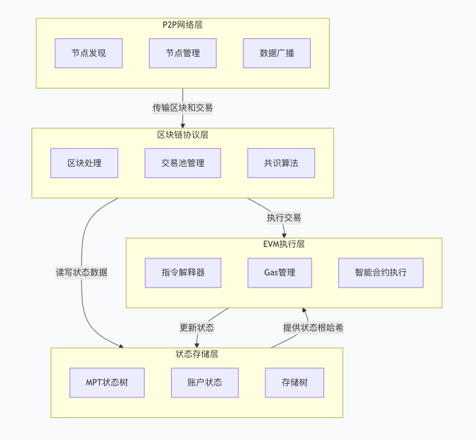
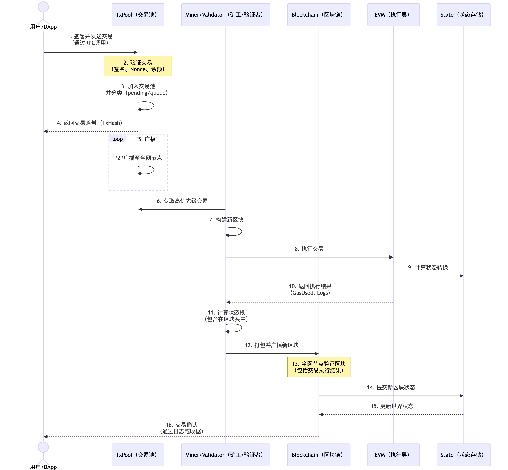
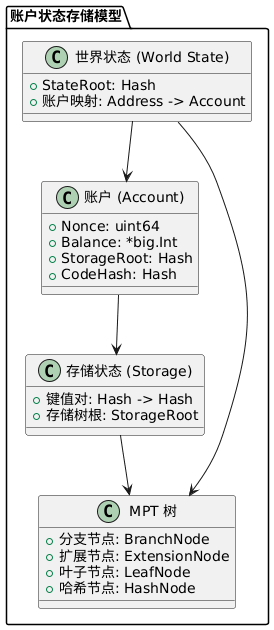
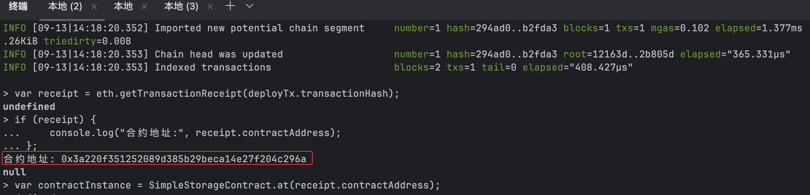

# 理论分析
## 阐述Geth在以太坊生态中的定位
Go-Ethereum（简称Geth）是以太坊区块链最主流的官方客户端实现之一，采用Go语言编写。作为以太坊网络的核心基础设施，Geth为全球数百万节点提供了参与区块链共识、验证交易和执行智能合约的能力。 主要负责节点运行、区块同步、交易广播、智能合约执行等核心功能。</br>  
Geth在以太坊生态中扮演着多重角色：既是维护网络去中心化的全节点实现，也是开发者与区块链交互的网关，同时还是部署智能合约和执行交易的核心引擎。</br>  
Geth的设计哲学遵循"模块化、可扩展、安全至上"的原则。其架构采用分层设计，各模块之间通过明确定义的接口进行通信，这种设计使得系统能够支持持续升级和硬分叉而不破坏现有功能。Geth遵循以太坊改进提案（EIP）标准，确保了与全球以太坊网络的互操作性和一致性，同时提供了对多种共识算法的支持，包括工作量证明（PoW）和权益证明（PoS）的过渡机制。</br>    
在以太坊生态中，Geth提供了以下几个关键功能：</br>  
1.全节点实现：完整存储区块链历史数据，验证所有交易和区块，参与网络共识</br>  
2.JSON-RPC接口：通过HTTP、WebSocket或IPC暴露API接口，支持与去中心化应用（DApps）交互</br>  
3.智能合约支持：编译、部署和执行以太坊智能合约的全生命周期管理</br>  
4.账户管理：创建和管理以太坊账户，支持交易签名和密钥安全存储</br>  
5.挖矿功能：虽然After The Merge后PoW挖矿已淘汰，但Geth仍支持在开发环境中进行挖矿测试</br>    
它是以太坊网络中最广泛使用的客户端之一，支持全节点、轻节点和私有链部署，推动以太坊生态的去中心化和安全性。</br>  
特点：Go语言实现、模块化、强调稳定性与可运维性（内置轻节点、调试接口、插件式共识历史支持）。</br>
## 核心模块交互关系
- 区块链同步协议（eth/62, eth/63）：</br>  
负责节点间区块、交易、状态等数据的同步，保证网络一致性。  </br>  
eth/62（旧版同步协议） ：基于请求-响应模型，节点通过 GetBlockHeaders/GetBlockBodies 消息批量获取区块。  </br>  
                 缺陷：易受DoS攻击（攻击者可请求海量数据），同步效率低。  </br>  
eth/63（新版快速同步协议） ：引入 State Trie 预取机制：  </br>  
  节点先下载区块头（Headers），验证 PoW/PoS 合法性  </br>  
  通过 GetNodeData 请求关键状态数据（如账户余额、合约存储）</br>  
  关键改进：eth/63 将同步时间从数天缩短至小时级，通过“状态快照”避免完整历史数据下载，降低新节点加入门槛。  </br>
- 交易池管理与Gas机制：</br>  
交易池（TxPool）负责缓存待处理交易，Gas机制用于衡量和限制计算资源消耗，防止滥用。  </br>
- EVM执行环境构建：</br>  
EVM（以太坊虚拟机）负责智能合约的解析与执行，保障合约代码的安全运行。  </br>
- 共识算法实现（Ethash/POS）：</br>  
Ethash(历史)为工作量证明（PoW）算法，现行使用POS权益证明，决定区块生产者和链安全。</br>
# 架构设计
## Geth架构图  
</br>
架构图说明：</br>
P2P网络层：负责节点发现、连接管理和区块交易数据的广播与同步，是区块链去中心化的基础。</br>
区块链协议层：这是Geth的核心，处理交易池（TxPool）、区块验证、共识算法（Ethash/Clique/PoS）和链重组（Reorg）。</br>
状态存储层：以Merkle Patricia Trie (MPT) 为核心数据结构，管理账户状态、合约存储和交易回执，并提供高效的状态验证和可验证性。</br>
EVM执行层：提供一个沙盒化的运行时环境，用于执行智能合约字节码，并严格计量Gas消耗。</br>
## 说明各层关键模块：
- les（轻节点协议）
  实现了以太坊轻客户端同步协议
  允许资源受限设备（手机、IoT设备等）连接以太坊网络
  只下载区块头并按需获取状态数据，显著减少存储需求
  通过Merkle证明验证数据完整性，无需完整区块数据
- trie（默克尔树实现）
  采用MPT（Merkle Patricia Trie）结构存储账户状态和交易
  支持高效的增删改查操作和历史状态访问
  通过哈希链接保证数据完整性和防篡改特性
  支持状态快照和增量更新，优化存储效率
- core/types（区块数据结构）
  定义区块、交易、收据等基础数据类型
  实现区块和交易序列化与反序列化
  提供交易签名验证和RLP编码功能
  支持区块链数据的有效性验证
## 交易生命周期流程图
</br>
关键阶段说明：</br>
提交与验证（1-4）：交易由用户签署后通过RPC发送到节点的交易池。TxPool验证其有效性（签名、账户余额、Nonce）。</br>
传播与打包（5-12）：有效交易被P2P广播到全网。矿工（PoW）或验证者（PoS）从交易池中选取交易，执行它们，并构建新区块。</br>
执行与确认（13-16）：新区块被广播，全网其他节点重新执行其中的交易以验证其有效性。验证通过后，区块被添加到链上，交易状态被最终确认。</br>
## 账户状态存储模型
</br>
Account各字段详细说明：</br>
Nonce：对于外部账户(EOA)，表示该账户已发送的交易数量；对于合约账户，表示该账户创建的合约数量。</br>
Balance：该账户持有的以太币余额，用于支付交易费和智能合约执行费。</br>
StorageRoot：合约账户存储树的Merkle根哈希（Hash of the storage root）。外部账户此字段为空。</br>
CodeHash：合约代码的Keccak256哈希值。外部账户此字段为空字符串的哈希值。</br>
状态树与存储树结构</br>
以太坊使用两种MPT树来管理状态：</br>
1. 全局状态树（World State Trie）</br>
键：160位的以太坊地址（keccak256(address)）</br>
值：上述账户结构体的RLP编码形式</br>
特点：每个区块都有唯一的状态树，其根哈希存储在区块头中作为状态承诺</br>
2. 存储树（Storage Trie）</br>
每个合约账户都拥有一棵独立的存储MPT</br>
键：合约存储槽（slot）的Keccak256哈希（通常由变量位置映射而来）</br>
值：存储在该槽中的值（RLP编码）</br>
特点：合约账户状态中的Root字段就是这棵存储树的根哈希</br>
# 实践验证
## 私有链搭建过程
1.编译运行Geth节点
```shell
# 克隆代码
git clone https://github.com/ethereum/go-ethereum.git
cd go-ethereum
# 编译Geth
make geth
./build/bin/geth version
```
2.运行开发模式节点
```shell 
./build/bin/geth --dev --http --http.api="eth,net,web3,miner,admin,txpool" --allow-insecure-unlock console
```
3.控制台验证
```shell
// 查看区块高度
eth.blockNumber

// 查看账户列表
eth.accounts

// 查看账户余额
eth.getBalance(eth.accounts[0])

4.搭建私有链
创建私有链的创世区块配置文件（genesis.json）：
```json
{
  "config": {
    "chainId": 12345,
    "homesteadBlock": 0,
    "eip150Block": 0,
    "eip155Block": 0,
    "eip158Block": 0,
    "byzantiumBlock": 0,
    "constantinopleBlock": 0,
    "petersburgBlock": 0,
    "istanbulBlock": 0,
    "berlinBlock": 0,
    "ethash": {}
  },
  "difficulty": "1",
  "gasLimit": "8000000",
  "alloc": {
    "7df9a875a174b3bc565e6424a0050ebc1b2d1d82": { "balance": "300000" },
    "f41c74c9ae680c1aa78f42e5647a62f353b7bdde": { "balance": "400000" }
  }
}
```
初始化和启动私有链：
```shell
# 初始化私有链
./build/bin/geth  --datadir ./private_chain init ./private_chain/genesis.json

# 启动私有链节点
./build/bin/geth --datadir ./private_chain --networkid 12345 --http --http.addr 127.0.0.1 --http.port 8545 --http.api personal,eth,net,web3,miner,admin,txpool,debug,clique --allow-insecure-unlock console
```
## 智能合约部署
1.简单存取合约
```solidity
// SimpleStorage.sol
pragma solidity ^0.8.20;
contract SimpleStorage {
    uint256 private v;
    event Stored(uint256 val);
    function set(uint256 val) public {
        v = val;
        emit Stored(val);
    }
    function get() public view returns (uint256) {
        return v;
    }
}
```
2.编译（solc 或 Hardhat）:
```shell
solcjs --optimize --bin --abi SimpleStorage.sol -o build
```
3.部署合约（Geth控制台）:
```shell
# 连接到 Sepolia 测试网
./build/bin/geth --sepolia account import /Users/mac/MySpace/work/goland_workspace/go-ethereum/private_file/sepolia_privateKey
./build/bin/geth --sepolia --http --http.api="eth,net,web3,miner,admin,txpool" --allow-insecure-unlock console
```
用 geth 控制台部署：
```javascript
// 1. 编译后的合约 ABI 和字节码
var abi = [{"anonymous":false,"inputs":[{"indexed":false,"internalType":"uint256","name":"val","type":"uint256"}],"name":"Stored","type":"event"},{"inputs":[],"name":"get","outputs":[{"internalType":"uint256","name":"","type":"uint256"}],"stateMutability":"view","type":"function"},{"inputs":[{"internalType":"uint256","name":"val","type":"uint256"}],"name":"set","outputs":[],"stateMutability":"nonpayable","type":"function"}];

var bytecode = "0x6080604052348015600e575f5ffd5b5060df80601a5f395ff3fe6080604052348015600e575f5ffd5b50600436106030575f3560e01c806360fe47b11460345780636d4ce63c146045575b5f5ffd5b6043603f3660046093565b6059565b005b5f5460405190815260200160405180910390f35b5f8190556040518181527fc6d8c0af6d21f291e7c359603aa97e0ed500f04db6e983b9fce75a91c6b8da6b9060200160405180910390a150565b5f6020828403121560a2575f5ffd5b503591905056fea2646970667358221220e67ae2022bf880b4148b2584c19b3de4e9890f220e68cec8a77bf65ce67ec5b464736f6c634300821a0033";

// 2. 创建合约对象
var SimpleStorageContract = eth.contract(abi);

// 3. 部署合约
var deployTx = SimpleStorageContract.new({
    from: eth.accounts[0],
    data: bytecode,
    gas: 3000000
});

// 4. 等待部署完成，获取交易回执
var receipt = eth.getTransactionReceipt(deployTx.transactionHash);
if (receipt) {
    console.log("合约地址:", receipt.contractAddress);
}

// 5. 创建合约实例
var contractInstance = SimpleStorageContract.at(receipt.contractAddress);

// 6. 调用合约方法
contractInstance.set.sendTransaction(42, {from: eth.accounts[0]});

// 7. 查询合约状态
var result = contractInstance.get.call();
console.log("存储的值:", result.toNumber());
```
4.部署合约截图
